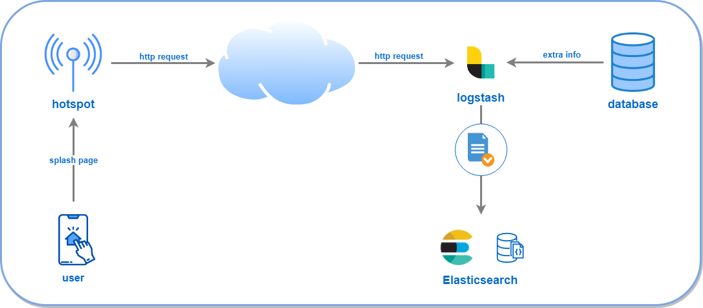

# enrich-http-logstash-ELK

**Logstash** has become one of the most commonly used **shipper**. One major reason for that is the endless list of plugins it brings out of the box, which gives you a strong flexibility to fetch data from different sources, process them and ship them to any destination.

In this project I shall focus on two of those plugins, **http** and **jdbc_streaming**. The former allows us to listen to incoming **http requests** and the latter sends **SQL queries** to an external database just when an input event is raised, in order to look up more data and enrich the process. 

Of course, there is a long list of situations where you could leverage those two plugins. I have chosen a scenario where the challenge is to track the user access through hotposts using a **land page**, something you have done more than once at airports or shopping centers. Please, take a look at the diagram below with the bigger picture



The hotspot will send through the http request only a few data, the rest of needed info, such as extra user info, can be extracted looking up our main database.

The http plugin is useful when the data to import are not readily accesible, but you can use a stable Internet connectivity. It comes to my mind

- IoT devices with sensors sending measurements autonomously
- Receive events from version control tools, e.g., GitHub
- Data collection from non-accesible data producers, when other solutions fail
- Send messages from other apps

We will start to build this project from scratch and you will be provided with all configuration files you need.

## Requirements

In a production environment you will be used to managing complex infrastructures with different servers, clusters, nodes, dockers, and so on. However, my proposal is to use just one **virtual machine** with **Ubuntu Server** which will hold a **MySQL** server, **Elasticsearch** and **Logstash**. Because of the data extraction Logstash does from our MySQL database to get the extra info, you need to install the **jdbc** connector as well.

Anyhow, you probably realised that **Kibana**  (the **K** for the **ELK Stack** package) is not going to be installed. In fact, it is a great tool which allows us to use a JSON interface to work with your cluster easily, sending requests and so on. No worries, `curl` software is more than enough to fulfil this project.

After installing the software above, you still need the **mybusiness sample database**, create an **index template** to make easier the document imports in the Elasticsearch engine, and finally, understand the provided **logstash configuration file**.

## Installation

Starting with a clean **Ubuntu Server 18.04** virtual machine (**Oracle VM VirtualBox**), you should install the open source software below

### MySQL
Install MySQL
```
$ sudo apt-get update && sudo apt-get install mysql-server
```
Run this utility to set a password for `root` account, remove test database, and so on
```
$ sudo mysql_secure_installation
```
Test installation is OK
```
$ sudo /bin/systemctl status mysql
``` 
Check you can access using mysql client
```
$ sudo mysql -u root -pXXXXX
```

### Elasticsearch

**Elasticsearch** is the core piece of the well known **ELK Stack** package, serving as a central data store. Its installation process is very well documented on [Elastic Site](https://www.elastic.co/guide/en/elasticsearch/reference/current/install-elasticsearch.html). Do not forget, you should use a `deb` package, suitable for **Ubuntu**.

Before starting, you may need to install the package `apt-transport-https`
```
$ sudo apt-get install apt-transport-https
```
Check your present Java version because perhaps yours is different from Java 8 or Java 11, which **Elasticsearch** needs
```
$ java -version
``` 
In case of several JVM on your system, use this command to change it and select the version 8
```
$ sudo update-alternatives --config java
```
You should be able to work with java version 8 and 11, but as of today, there is a bug affecting to Logstash 7.2.0, jdbc drivers and Java version 11. 

Elasticsearch signs all its installation packages with a PGP key, download and install that key
```
$ wget -qO - https://artifacts.elastic.co/GPG-KEY-elasticsearch | sudo apt-key add -
``` 
Save the repository definition
```
$ echo "deb https://artifacts.elastic.co/packages/7.x/apt stable main" | sudo tee -a /etc/apt/sources.list.d/elastic-7.x.list
```
Install Elasticsearch. In this step, select the exact version you want to install, instead of the last one. Maybe you did not know you could do it. Anyway, feel free to use the current version, it is up to you. Personally, I never use the very last version
```
$ sudo apt-get update && sudo apt-get install elasticsearch=7.2.0
```
Some changes should be made in file `/etc/elasticsearch/elasticsearch.yml`. The first one to bind to this server from any other IP
```
network.host: 0.0.0.0
```
The second one allows us to skip the bootstrap checks, because it thinks you are in a production deployment
```
discovery.type: single-node
```
Enable and start the new service, it might take a few minutes
```
$ sudo /bin/systemctl daemon-reload
$ sudo /bin/systemctl enable elasticsearch.service
$ sudo /bin/systemctl start elasticsearch.service
``` 
Test installation is OK and Elasticsearch service is up using `curl`. It could take a few minutes
```
$ curl -XGET "localhost:9200"
```

### Logstash

Thanks to the previous Elasticsearch installation you can install **Logstash** easily running
```
$ sudo apt-get update && sudo apt-get install logstash=1:7.2.0-1
```
I know, it is a bit tricky how to specify an earlier version to install in Logstash.

Unlike Elasticsearch, Logstash is not installed as a service, you will run it by command line.

### jdbc driver

You can get a jdbc mysql connector from [dev.mysql.com](https://dev.mysql.com/downloads/connector/j), or if you prefer, use this [mysql-connector-java.jar](database/mysql-connector-java.jar). Leave that file in your system, for instance

```
/etc/logstash
```

## Setting up

After all software is installed, it is time to configuration tasks.

### Database

The file [mybusiness-database.sql](database/mybusiness-database.sql) contains a script to create the database `mybusiness`. You can run it into your MySQL
```
$ sudo mysql -u root -pXXXX < mybusiness-database.sql
```
This database only stores two tables with columns below

- hotspot: id, description, location, ip
- user: id, email, name, birthday, country, city

All those columns make the **extra info** which Logstash reads and will index into your elasticsearch cluster. Remember the http request only contains a part of the data that will be indexed into Elasticsearch

You should also create a read-only user that Logstash needs to read from that database. Run the script [logstash-user.sql](database/logstash-user.sql) into the database to create the user `logstash`

```
$ sudo mysql -u root -pXXXX < logstash-user.sql
```

### Index template

If you do not create an index before use it, specifying its fields and types, Elasticsearch will generate one for you based on the documents you insert, according to a set of predefined set of rules. That is called **dynamic mapping**. This is quite handy when you work with time series and every new day with data produces a new index.

Personally, I always prefer to control as much as possible any new index creation, ensuring name and type of fields are exactly as I want. You can do it in Elasticsearch using **index templates**. 

Run the command below to create the **hotspot-user-access template**. You can run it again and again, if you make any mistake, template is overwritten. It is available in [hotspot-user-access-template.json](ELK/hotspot-user-access-template.json).

```
$ curl -XPUT "localhost:9200/_template/hotspot-user-access-template" -H "content-type: application/json" -d '
{
  "index_patterns": ["hotspot-user-access-*"],
  "mappings": {
    "properties": {
      "hotspot_id": { "type": "integer" },
      "hotspot_desc": { "type": "text" },
      "hotspot_location": { "type": "geo_point" },
      "hotspot_ip": { "type": "ip" },
      "user_id": { "type": "integer" },
      "user_email": { "type": "text" },
      "user_mac": { "type": "text" },
      "user_mobile_manufacturer": {
        "type": "text",
        "fields" : { "raw" : { "type" : "keyword", "ignore_above" : 100 } }
      },
      "user_birthday": { "type": "date", "format": "strict_year_month_day" },
      "user_name": { "type": "text" },
      "user_city": { "type": "keyword" },
      "user_country": { "type": "keyword" },
      "@timestamp": { "type": "date" }
    }
  },
  "aliases": {
    "hotspot-user-access": { }
  }
}
'
```

Every new index matching the name pattern `hotspot-user-access-*` will have this type schema. Here is the final info which is stored in Elasticsearch. Some fields come directly from the http request (`hotspot_ip`, `user_id`, `user_mac`, and `user_mobile_manufacturer`), while others are looked up in the database (`hotspot_desc`,  `hotspot_location`, `hotspot_ip`,`user_email`, `user_birthday`, `user_name`, `user_city`, `user_country`). Finally, `@timestamp` is obtained by Logstash just when the request is received.

At the botton, you will note, an `alias` is created as well. Very useful for searches in all indices at once, like this

```
$ curl -XGET "localhost:9200/hotspot-user-access/_search?pretty" -H "content-type: application/json" -d '
{
  "query": {
    "range": {
      "@timestamp": {
        "gte": "2019-01-01",
        "lte": "2019-12-31"
      }
    }
  },
  "sort": [
    { "@timestamp": "asc" }
  ]
}'
```

### Logstash configuration

Now we come to the most challenging and tricky part, I mean, how to configure Logstash to 

- Listen to any incoming http request from the specified port
- Parse received data 
- Search for needed extra info accessing to your database
- Build the final document to index
- Index that document into an Elasticsearch index

It is easier than it seems. It just needs to run Logstash specifying the configuration file to use, according to the task to fulfil. You might consider it as a three-stage process. In our particular case

1. Input: configure port and security
2. Filter: parse received data, access to database, and prepare final document
3. Output: Elasticsearch endpoint and index name

Logstash gives you a lot of **plugins** out of the box to do those tasks. If you open the provided configuration file [http-hotspot-user-access.conf](ELK/http-hotspot-user-access.conf) you will see what I mean. Keep in mind, all plugins are executed sequentially. 

Leave this file in your system, for instance

```
/etc/logstash
```

Let us focus on the most interesting parts in this `conf` file

#### http plugin

This [input plugin](https://www.elastic.co/guide/en/logstash/current/plugins-inputs-http.html) allows you to reveive events over http(s). The parameter `id` is useful if you have several configurations running at the same time, much easier to check logs. It is advisable to set a `user/password` which your request sender will use

```
	http {
	
		# identify this input, useful in logstash logs
		id => "hotspot_user_access_http_plugin"
	
		# port open in network sections VirtualBox
		port => "3333"
		
		# security
		user => "http"
		password => "http"
 	}
```

#### grok plugin

This [filter plugin](https://www.elastic.co/guide/en/logstash/current/plugins-filters-grok.html) parses text using predefined patterns. It is very important in our configuration file because sets the **http request pattern**, something the sender must know

```
	grok {
		match => {
			"[headers][request_path]" => "%{WORD:api_name}/%{NUMBER:hotspot_id}\?user=%{NUMBER:user_id}&mac=%{MAC:user_mac}&brand=%{WORD:user_mobile_manufacturer}"
		}
	}
```

If you consider our http request (as we will see in detail in [Testing](##-Testing) section)

```
.../hotspot/2?user=1&mac=40:cb:c0:25:87:39&brand=Apple
```

After parsing the text above you got these value

```
api_name -> hotspot
hotspot_id -> 2
user_id -> 1
user_mac -> 40:cb:c0:25:87:39
user_mobile_manufacturer -> Apple
```

#### jdbc_streaming plugin

This [filter plugin](https://www.elastic.co/guide/en/logstash/current/plugins-filters-jdbc_streaming.html) runs a **SQL query** against the specified database using a jdbc connection.

Note that we are using the database user `logstash/logstash` and the mysql conector you copied into your system. The `statement` parameter holds the SQL query which might admit `parameters`. The result is stored in the field specified as `target`, in fact, this is an array of values

```
	jdbc_streaming {
		jdbc_driver_library => "/etc/logstash/mysql-connector-java.jar"
		jdbc_driver_class => "com.mysql.jdbc.Driver"
		jdbc_connection_string => "jdbc:mysql://localhost:3306/mybusiness"
		jdbc_user => "logstash"
		jdbc_password => "logstash"
		statement => "..."
		parameters => { 
			"hotspot" => "hotspot_id" 
			"user" => "user_id" 
		}	
		target => "myData"
	}
```

#### mutate plugin

Very useful [filter plugin](https://www.elastic.co/guide/en/logstash/current/plugins-filters-mutate.html) which allow us to rename, remove, add fields.

```
	mutate {
		rename => {"[myData][0][user_email]" => "user_email"}

		add_field => {
		  "hotspot_location" => "%{[myData][1][hotspot_latitude]}, %{[myData][1][hotspot_longitude]}"
		}
		
		remove_field => ["host", "headers", "message", "@version", "api_name", "myData"]
	}
```

I am sure you are wondering why there are two rows in the returned data `[myData][0]` and `[myData][1]`. User and hotspot data come from different tables in our `mybusiness` database. The first row contains user info and the second hotpot data.

#### drop plugin

In case of **errors** parsing the entry data or accessing to the database, nothing is indexed into Elasticsearch. `_grokparsefailure` and `_jdbcstreamingfailure` are automatically added into `[tags]` when a parsing or jdbc error respectively happen. In that case, you can leverage [drop plugin](https://www.elastic.co/guide/en/logstash/current/plugins-filters-drop.html) to turn down the present event

```
	if "_grokparsefailure" in [tags] or [api_name] != "hotspot" {
		drop { }
	}
```

```
	if ![myData][1][hotspot_ip] or ![myData][0][user_email] or "_jdbcstreamingfailure" in [tags] {
		drop { }
	}
```

#### elasticsearch plugin

Finally, we use this [output plugin](https://www.elastic.co/guide/en/logstash/current/plugins-outputs-elasticsearch.html) to index into Elasticsearch the final document. Notice how the name of the index is built, the pattern `%{+YYYY.MM.dd}` is based on the field `@timestamp` which, as seen previously, is obtained automatically when the http request is received.

```
	elasticsearch {
		hosts => "http://localhost:9200"
		index => "hotspot-user-access-%{+YYYY.MM.dd}"
		manage_template => false
	}
```

## Testing

Once all needed software is installed, index template created, sample database loaded, and every configuration file in its place, it is time to test everything works as expected.

Firstly, open a new terminal session on your Ubuntu VM and run Logstash with this command

```
$ sudo /usr/share/logstash/bin/logstash --path.settings /etc/logstash -f /etc/logstash/http-hotspot-user-access.conf
```

Afer a while you will receive some messages like these

```
[2019-09-07T18:25:59,320][INFO ][logstash.inputs.http] Starting http input listener {:address=>"0.0.0.0:3333", :ssl=>"false"}
...
[2019-09-07T18:26:03,845][INFO ][logstash.agent] Successfully started Logstash API endpoint {:port=>9600}
```

It means, Logstash and its http listener are ready. You can stop it sending a termination signal `Ctrl+c`

Secondly, you have to send http request to the specified port following the pattern

```
/API_NAME/HOTSPOT_ID?user=USER_ID&mac=USER_MAC&brand=USER_MOBILE_MANUFACTURER
```

Where API_NAME in our case is `hotspot`. USER_ID and HOTSPOT_ID only could be in a set of values according to the content in tables `user` and `hotspot`. USER_MAC and USER_MOBILE_MANUFACTURER are on you.

Open a second terminal session and use `curl` to send these http requests. Note you must use **basic authentication**

```
$ curl -u http:http "http://localhost:3333/hotspot/2?user=3&mac=40:cb:c0:25:87:39&brand=Xiaomi"
$ curl -u http:http "http://localhost:3333/hotspot/1?user=2&mac=b0:ca:68:71:df:89&brand=Apple"
```

Try to index something wrong like this

```
$ curl -u http:http "http://localhost:3333/hotspot/123456?user=654321&mac=40:cb:c0:25:87:39&brand=Xiaomi"
$ curl -u http:http "http://localhost:3333/hotspots/1?user=2&mac=b0:ca:68:71:df:89&brand=Apple"
```

Check both commands have indexed documents in Elasticsearch with this easy query

```
$ curl -XGET "localhost:9200/hotspot-user-access/_search?pretty"
```

You can list all the new indices in your cluster with this command
```
$ curl -XGET "localhost:9200/_cat/indices?v=true&s=index&index=hotspot-user-access*"
```

Remove when needed all indices created by your Logstash process

```
$ curl -XDELETE "localhost:9200/hotspot-user-access-*"
```

If you are playing with Logstash configuration file `http-hotspot-user-access.conf`. I will give you a tip. You do not need to restart Logstash every time you modified its `conf` file. You might run it using the option `-r` or `--config-reload-automatic` forcing to reload whenever the configuration is changed.

```
$ sudo /usr/share/logstash/bin/logstash --path.settings /etc/logstash --config.reload.automatic -f /etc/logstash/http-hotspot-user-access.conf
```

## Wrapping up

In this project we have learnt

- Install MySQL
- Install Elasticsearch
- Index templates
- Alias in Elasticsearch
- Install Logstash
- Implement a complex pipeline using plugins: http, jdbc_streaming, grok, mutate, drop, elasticsearch
- Handle errors in Logstash pipelines

